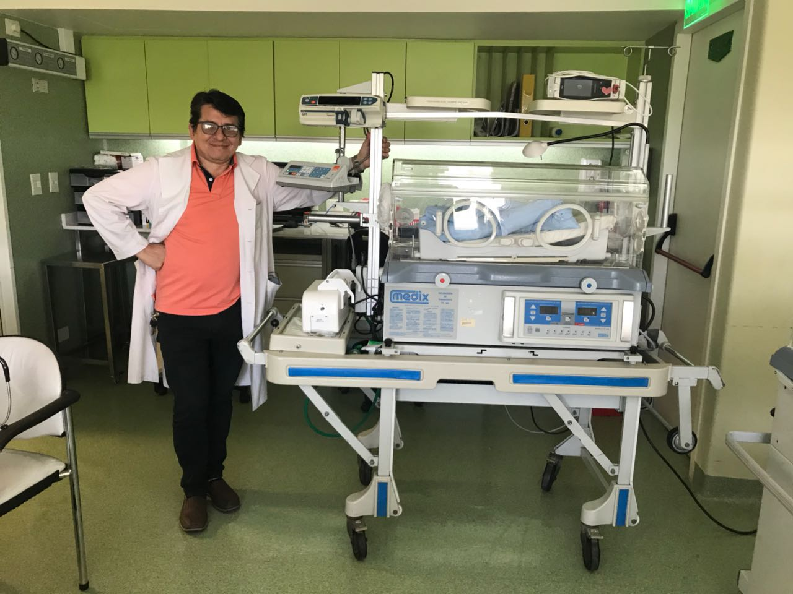

/README.md
# Diagnóstico Técnico — Incubadora
## Tipo de equipo
Incubadora (uso médico / laboratorio)
## Falla reportada
El equipo presentaba alarma de falla de aire. Además, se requería la adaptación e integración de una jeringa de infusión, un oxímetro de pulso y un respirador portátil al entorno de la incubadora.
## Evaluación inicial
- Inspección visual general
- Verificación de alimentación eléctrica
- Control de sensores y temperatura
- Revisión de ventilación interna
## Procedimiento realizado
- Diagnóstico técnico completo
- Pruebas funcionales
- Correcciones aplicadas (si corresponde)
## Resultado
Luego del diagnóstico y las pruebas funcionales, se verificó la correcta circulación de aire y el funcionamiento de sensores y ventilación interna. Se integraron correctamente la jeringa de infusión, el oxímetro de pulso y el respirador portátil. El equipo operó de manera estable sin activación de alarmas.
## Estado actual
Operativa
## Documentado por
Edgard-Tech
