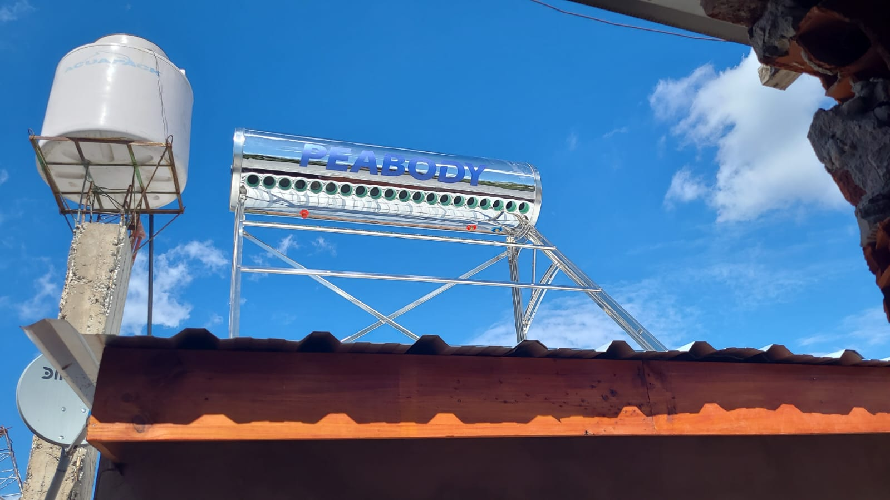

# Instalación de Sistema Termosolar

## Tipo de proyecto
Instalación y puesta en marcha de termotanque solar para agua sanitaria.

## Objetivo
Aprovechar energía solar térmica para provisión de agua caliente, reduciendo el consumo de gas/energía convencional y mejorando la eficiencia energética del sistema domiciliario.

## Datos del equipo
- Tipo: Termotanque solar (termosifón / presión directa)*  
- Capacidad: (completar en litros)  
- Ubicación: (techo / terraza / estructura dedicada)  
- Marca / modelo: (completar)

\* Ajustar según el equipo real.

## Relevamiento inicial
- Verificación de estructura de soporte disponible.
- Revisión de pendiente y orientación del techo.
- Verificación de puntos de anclaje.
- Evaluación de recorrido de cañería (ida y retorno).
- Revisión de fuente de agua fría y conexión a red existente.

## Componentes instalados
- Termotanque solar (colector + tanque acumulador).
- Estructura de soporte y anclajes.
- Cañerías de agua fría y caliente.
- Válvulas de corte y seguridad.
- Aislación térmica en tramos expuestos (si aplica).
- By-pass a red de agua caliente existente (si corresponde).

## Procedimiento de instalación
1. Marcado y fijación de la estructura de soporte.
2. Nivelación y aseguramiento mecánico del termotanque solar.
3. Tendido de cañerías de alimentación y salida de agua caliente.
4. Colocación de válvulas de corte, purga y seguridad.
5. Conexión al sistema de agua caliente existente.
6. Prueba de estanqueidad (fugas) y purgado de aire.
7. Llenado del circuito y verificación general.

## Pruebas funcionales
- Verificación de circulación adecuada de agua.
- Control de fugas en uniones y conexiones.
- Medición de temperatura de salida luego de ciclo de exposición solar.
- Comprobación de funcionamiento conjunto con sistema de apoyo (gas/eléctrico) si lo hubiera.

## Resultado
El sistema termosolar quedó instalado, fijado mecánicamente y conectado a la red de agua caliente. Tras las pruebas funcionales, se verificó buena circulación de agua y aumento de temperatura conforme a las condiciones de radiación solar.

## Estado actual
Operativo

## Documentado por
Edgard-Tech
